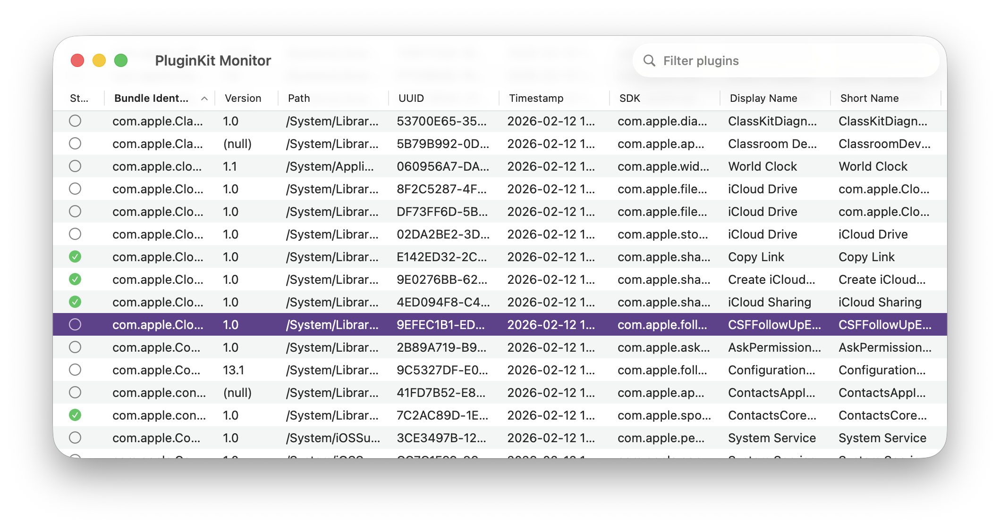

# PluginKit Monitor

A lightweight macOS developer tool that gives you a live, searchable overview of every app extension registered on your system via `pluginkit -mvvvv`.

## Why?

When developing app extensions (Widgets, Share extensions, Intents, etc.) it is often useful to verify that macOS has picked up your latest build, check its registration timestamp, or confirm the election state. Running `pluginkit` in Terminal works, but the output is verbose and hard to scan. PluginKit Monitor turns that output into a sortable, filterable table that refreshes every second.

## Features

- **Auto-refresh** - Polls `pluginkit -mvvvv` once per second so you always see the current state.
- **Search** - Filter by bundle identifier, path, display name, short name, or parent name.
- **Sortable columns** - Click any column header to sort.
- **Multi-select** - Select one or more rows (selection is stable across refreshes).
- **Election state** - Visual status indicators showing whether a plug-in is elected, ignored, used for debugging, superseded, or in an unknown state.

## Columns

| Column | Description |
|---|---|
| Status | User election state (`+` elected, `-` ignored, `!` debugger, `=` superseded, `?` unknown) |
| Bundle Identifier | `CFBundleIdentifier` of the `.appex` |
| Version | Version string (may be `(null)`) |
| Path | Absolute path to the `.appex` bundle |
| UUID | System-assigned plug-in UUID |
| Timestamp | Registration timestamp |
| SDK | Extension point SDK (e.g. `com.apple.widgetkit-extension`) |
| Display Name | User-facing name |
| Short Name | Abbreviated name |
| Parent Name | Containing application, if any |

## Requirements

- macOS 26.2+
- Xcode 26.3+
- App Sandbox is **disabled** because the app needs to spawn `/usr/bin/pluginkit`.

## Building

Open `PluginKitMonitor.xcodeproj` in Xcode and run the `PluginKitMonitor` scheme.

## License

This project is licensed under the [GNU General Public License v3.0](LICENSE).
